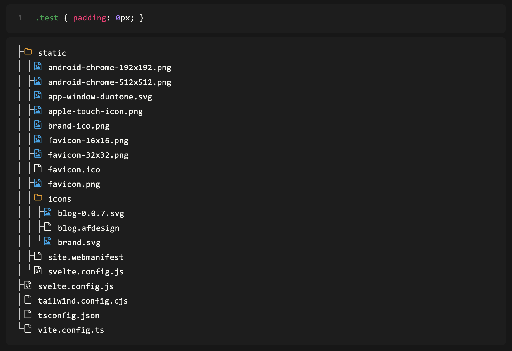

# @mhafemann/svelte-preprocessor-prism
[](https://www.npmjs.com/package/mhafemann/svelte-preprocess-prism) [](https://github.com/mhafemann/svelte-preprocess-prism/blob/main/LICENSE) 

A [Svelte](https://svelte.dev/) preprocessor that generates highlighted code with [Prism.js](https://prismjs.com/).
Inspired by: [Bjorn Lu](https://twitter.com/bluwyoo) - [Bending Svelte using pre-processors](https://www.youtube.com/watch?v=glp4iEBTkvQ).


- [Dependencies](#dependencies)
- [Installation](#installation)
- [Configuration](#configuration)
- [Usage](#usage)
- [Todo](#todo)


## Dependencies
|Dependency|Version|
|---|---|
| [magic-string](https://www.npmjs.com/package/magic-string)| ^0.30.1 |
| [prismjs](https://www.npmjs.com/package/prismjs)| ^1.29.0 |
| [svelte](https://www.npmjs.com/package/svelte)| ^4.0.5 |

## Installation

Install with your preferred package manager.

```bash
pnpm i -D @mhafemann/svelte-preprocessor-prism
```

## Configuration

Add the preprocessor to your `svelte.config.js` file.

```javascript
// svelte.config.js
import adapter from '@sveltejs/adapter-auto';
import { vitePreprocess } from '@sveltejs/kit/vite';
import sveltePrism from '@mhafemann/svelte-preprocessor-prism';

/** @type {import('@sveltejs/kit').Config} */
const config = {
    // Consult https://kit.svelte.dev/docs/integrations#preprocessors
    // for more information about preprocessors
    preprocess: [vitePreprocess({}), sveltePrism],
    files: {
        ['$lib']: 'src/lib',
    },
    kit: {
        // adapter-auto only supports some environments, see https://kit.svelte.dev/docs/adapter-auto for a list.
        // If your environment is not supported or you settled on a specific environment, switch out the adapter.
        // See https://kit.svelte.dev/docs/adapters for more information about adapters.
        adapter: adapter(),
    },
};

export default config;
```

## Usage

Add the `language-<language>` class to your `<pre>` tag. The `<code>` tag is optional.


```svelte
<!-- +page.svelte -->
<script>
// ...
</script>


<pre class="language-css"><code>{`.test { padding: 0px; }`}</code></pre>

<pre class="language-treeview">
<code>
{`
├── static/
│   ├── android-chrome-192x192.png
│   ├── android-chrome-512x512.png
│   ├── app-window-duotone.svg
│   ├── apple-touch-icon.png
│   ├── brand-ico.png
│   ├── favicon-16x16.png
│   ├── favicon-32x32.png
│   ├── favicon.ico
│   ├── favicon.png
│   ├── icons/
│   │   ├── blog-0.0.7.svg
│   │   ├── blog.afdesign
│   │   └── brand.svg
│   ├── site.webmanifest
│   └── svelte.config.js
├── svelte.config.js
├── tailwind.config.cjs
├── tsconfig.json
└── vite.config.ts`}
</code>
</pre>
```




## Todo

- [x] Add support for [Prism plugins](https://prismjs.com/plugins/)
- [ ] Add configuration options
- [x] Add TypeScript support
- [ ] Add Tests

